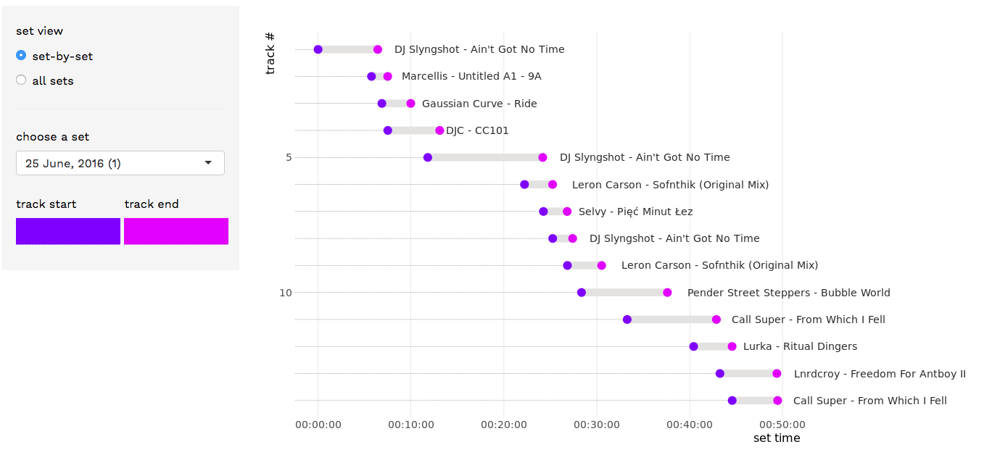

<!-- README.md is generated from README.Rmd. Please edit that file -->

```{r, include = FALSE}
knitr::opts_chunk$set(
  collapse = TRUE,
  comment = "#>",
  fig.path = "man/figures/README-",
  out.width = "100%"
)
```

# deejae

> *Copyright 2019 [Ewen Henderson](http://ewen.io/). Licensed under the MIT license.*



deejae is a an ongoing open-source effort to help DJs explore and visualise their selections, built using the [Shiny](https://shiny.rstudio.com/) web development framework. Native support is currently provided for [Traktor](https://www.native-instruments.com/en/products/traktor/) users only.

## Use

Visit [apps.ewen.io/deejae](https://apps.ewen.io/deejae/) to use `deejae`.

1. Upload .nml Traktor history files
2. Explore your selections
3. Export any visuals you wanna keep

You can also run the app locally, from an R session, by simply running:

```{r, eval=FALSE}
library(shiny)
runGitHub(repo = "ewenme/deejae", subdir = "inst/shiny")
```

## Credits

The primary typeface family in the app is [Work Sans](https://github.com/weiweihuanghuang/Work-Sans), developed by [Wei Huang](https://twitter.com/w__h_). 

The [shiny](https://cran.r-project.org/web/packages/shiny/index.html) development framework and extensions [shinyjs](https://cran.r-project.org/web/packages/shinyjs/index.html), [shinyalert](https://cran.r-project.org/web/packages/shinyalert/index.html) and [shinythemes](http://rstudio.github.io/shinythemes/) helped to fully realise this work. 
